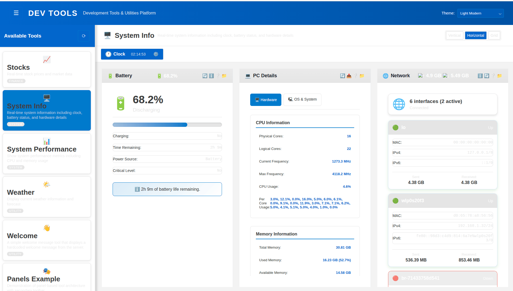

# Dev Tools App

A modular, extensible development tools application built with Flask backend and vanilla JavaScript frontend. This platform provides a unified interface for various development utilities, allowing developers to easily create and integrate new tools.


*Screenshot showing the System Info tool with multiple view modes available, including flexible layout with drag-and-drop panels*

## Features

- **Modular Architecture**: Tools are self-contained modules that can be added or removed independently
- **Two Tool Types**: Support for both regular tools and panel-based tools with collapsible panels
- **Advanced Panel Views**: Panel-based tools support multiple view modes (vertical, horizontal, grid, flexible) with drag-and-drop and resizing capabilities
- **Flexible Layout Mode**: Freely position and resize panels anywhere on screen with absolute positioning
- **Theme System**: Multiple built-in themes including dark and light modes
- **Responsive Design**: Works on desktop and mobile devices
- **RESTful API**: Clean API endpoints for tool communication
- **Dynamic Loading**: Tools are loaded on-demand without page refreshes

## Project Structure

```
dev_utils/
├── backend/
│   ├── main.py                 # Flask application entry point
│   ├── tool_manager.py         # Tool discovery and registration
│   ├── requirements.txt        # Python dependencies
│   └── tools/                  # Tool modules
│       └── dev-tool-*/         # Individual tool directories
│           ├── tool.py         # Tool metadata and backend logic
│           ├── api.py          # API endpoints registration
│           └── requirements.txt # Tool-specific dependencies (optional)
├── frontend/
│   ├── index.html              # Main application template
│   └── static/
│       ├── css/                # Stylesheets
│       ├── js/                 # JavaScript modules
│       │   └── services/       # Service modules
│       └── tools/              # Frontend tool implementations
│           └── dev-tool-*/     # Tool frontend code
│               ├── index.html  # Tool UI (for regular tools)
│               ├── script.js   # Tool logic (for regular tools)
│               ├── style.css   # Tool styles (optional)
│               └── panels/     # Panel files (for panel-based tools)
│                   └── *.js    # Individual panel implementations
```

## Installation

### Prerequisites

- Python 3.8+
- pip (Python package manager)

### Setup Steps

1. **Clone the repository**
   ```bash
   git clone <repository-url>
   cd dev_utils
   ```

2. **Install backend dependencies**
   ```bash
   cd backend
   pip install -r requirements.txt
   ```

3. **Install tool-specific dependencies** (if any)
   ```bash
   # For each tool that has requirements.txt
   cd tools/dev-tool-<name>
   pip install -r requirements.txt
   ```

4. **Start the application**
   ```bash
   cd backend
   python main.py
   ```

5. **Open in browser**
   ```
   http://127.0.0.1:5000
   ```

### Configuration

The project includes a `.env` file in the repository root that contains default configuration settings. You can edit this file to customize the application behavior:

```env
# Server Configuration
HOST=127.0.0.1          # Server host (default: 127.0.0.1)
PORT=5000              # Server port (default: 5000)
DEBUG=True             # Enable debug mode (default: True)
```

Edit the `.env` file directly to change these settings before starting the server.

## Usage

1. **Select Tools**: Use the drawer on the left to browse available tools
2. **Switch Themes**: Use the theme selector in the top-right corner
3. **Tool Interaction**: Each tool provides its own interface and functionality

## Panel View Modes

Panel-based tools support multiple layout modes that can be switched using the view mode buttons in the secondary toolbar:

### Vertical Mode (Default)
- Panels are stacked vertically in a single column
- Best for focused, sequential workflows
- Panels expand to full width

### Horizontal Mode
- Panels are arranged side-by-side in a single row
- Ideal for comparing related information
- Equal width distribution with horizontal scrolling if needed

### Grid Mode
- Panels are arranged in a 2x2 grid layout
- Perfect for dashboard-style displays
- Balanced layout for multiple data sources

### Flexible Mode
- **Absolute Positioning**: Panels can be freely positioned anywhere on screen
- **Drag & Drop**: Click and drag panels to reposition them
- **Resizing**: Drag panel borders/corners to resize panels
- **Persistent Layout**: Panel positions and sizes are saved and restored
- **Multi-directional Resize**: Resize from any border (top, bottom, left, right) or corner
- **Layer Management**: Most recently moved/resized panels appear on top

#### Flexible Mode Controls:
- **Drag**: Click and hold panel header to drag
- **Resize**: Hover near panel borders/corners, cursor changes to indicate resize direction
- **Reset**: Switch view modes to reset layout (positions persist per tool)

## Developer Guide

### Creating a New Tool

This guide provides step-by-step instructions for creating both regular tools and panel-based tools.

#### Step 1: Choose Tool Type

**Regular Tool**: Single-page interface with custom HTML/CSS/JS
- Best for: Simple utilities, forms, data display
- Example: Welcome message, weather display

**Panel-Based Tool**: Multiple collapsible panels with shared toolbar and advanced view modes
- Best for: Complex dashboards with customizable layouts
- Features: Multiple view modes (vertical, horizontal, grid, flexible), drag-and-drop positioning, panel resizing
- Example: System information with separate battery, network, hardware panels that can be freely arranged

#### Step 2: Backend Implementation

1. **Create tool directory**
   ```bash
   mkdir backend/tools/dev-tool-mytool
   cd backend/tools/dev-tool-mytool
   ```

2. **Create `tool.py`**
   ```python
   def get_tool_info():
       return {
           'name': 'My Tool',
           'description': 'Description of what my tool does',
           'category': 'utility',  # or 'system', 'productivity', etc.
           'icon': '🔧',  # Any emoji or symbol
           'version': '1.0.0',
           # For panel-based tools, add:
           'has_panels': True,  # Set to True for panel-based tools
           'panels': ['panel1', 'panel2'],  # List of panel names
       }
   ```

3. **Create `api.py`**
   ```python
   from flask import Blueprint, jsonify

   def register_apis(app, base_path):
       @app.route(f'{base_path}/data', methods=['GET'])
       def get_data():
           return jsonify({
               'success': True,
               'data': {'message': 'Hello from my tool!'}
           })
   ```

4. **Optional: Create `requirements.txt`** for tool-specific dependencies
   ```
   requests==2.31.0
   ```

#### Step 3: Frontend Implementation

##### For Regular Tools

1. **Create frontend directory**
   ```bash
   mkdir -p frontend/static/tools/dev-tool-mytool
   cd frontend/static/tools/dev-tool-mytool
   ```

2. **Create `index.html`**
   ```html
   <div class="my-tool">
       <div class="tool-body">
           <h3>My Tool Interface</h3>
           <div id="content">Loading...</div>
       </div>
   </div>
   ```

3. **Create `script.js`**
   ```javascript
   window.tool_script = {
       container: null,

       // Initialize the tool (MANDATORY - called when tool is loaded)
       async init(container) {
           this.container = container;
           await this.loadData();
       },

       // Destroy the tool (MANDATORY - called when tool is unloaded)
       destroy(container) {
           // Clean up event listeners, intervals, etc.
       },

       async loadData() {
           try {
               const response = await fetch('/api/dev-tool-mytool/data');
               const result = await response.json();
               if (result.success) {
                   this.displayData(result.data);
               }
           } catch (error) {
               console.error('Error loading data:', error);
           }
       },

       displayData(data) {
           const content = this.container.querySelector('#content');
           content.textContent = data.message;
       }
   };
   ```
   
   > **Mandatory Functions:** Every regular tool must implement `init(container)` and `destroy(container)` functions. The `init` function is called when the tool is loaded and receives the tool container element. The `destroy` function is called when the tool is unloaded and should clean up any resources like event listeners or timers.

4. **Optional: Create `style.css`**
   ```css
   .my-tool {
       padding: 20px;
   }

   .tool-body {
       background: var(--bg-color);
       border-radius: 8px;
       padding: 16px;
   }
   ```
   
   > **Note:** Avoid overriding existing framework CSS classes (like `.tool-container`, `.tool-header`, `.tool-body`, etc.) unless absolutely necessary. Create custom CSS classes and add them to your HTML elements to ensure compatibility with framework updates.

##### For Panel-Based Tools

1. **Create frontend directory**
   ```bash
   mkdir -p frontend/static/tools/dev-tool-mytool/panels
   cd frontend/static/tools/dev-tool-mytool
   ```

2. **Create panel files** (one JS file per panel)
   ```javascript
   // panels/panel1.js
   window.panel1 = {
       // MANDATORY: Panel display name (string)
       name: 'Panel 1',
       
       // MANDATORY: Panel icon (string - emoji or symbol)
       icon: '📊',
       
       // MANDATORY: Panel description (string)
       description: 'First panel description',
       
       // MANDATORY: Initialize panel (function called when panel loads)
       async init(container, headerStatusContainer) {
           this.container = container;
           this.headerStatusContainer = headerStatusContainer;
           await this.loadData();
       },

       // MANDATORY: Destroy panel (function called when panel unloads)
       destroy() {
           if (this.intervalId) {
               clearInterval(this.intervalId);
           }
       },

       // MANDATORY: Buttons shown when panel is collapsed (array)
       collapseModeButtons: [],

       // MANDATORY: Buttons shown when panel is expanded (array)
       expandModeButtons: [
           {
               callback: function() { this.refresh(); },
               title: "Refresh",
               icon: "🔄"
           }
       ],

       // MANDATORY: Called when panel expands (function)
       onExpand() {
           console.log('Panel expanded');
       },

       // MANDATORY: Called when panel collapses (function)
       onCollapse() {
           console.log('Panel collapsed');
       },

       async loadData() {
           // Load and display data
           const response = await fetch('/api/dev-tool-mytool/panel1-data');
           const data = await response.json();
           this.container.innerHTML = `<p>${data.message}</p>`;
       },

       refresh() {
           this.loadData();
       }
   };
   ```
   
   > **Mandatory Fields and Functions:** Every panel must implement these required properties:
   > - `name` (string): Display name for the panel
   > - `icon` (string): Icon emoji/symbol for the panel
   > - `description` (string): Brief description of the panel
   > - `init(container, headerStatusContainer)` (function): Called when panel loads
   > - `destroy()` (function): Called when panel unloads for cleanup
   > - `collapseModeButtons` (array): Buttons shown in collapsed state
   > - `expandModeButtons` (array): Buttons shown in expanded state
   > - `onExpand()` (function): Called when panel expands
   > - `onCollapse()` (function): Called when panel collapses

3. **Optional: Create `style.css`** for panel styling

   ```css
   /* Custom styles for dev-tool-mytool - DO NOT override framework classes */
   
   /* Add custom classes to your panel HTML elements */
   .my-tool-custom-header {
       background: linear-gradient(135deg, #667eea 0%, #764ba2 100%);
       color: white;
       padding: 12px 16px;
       border-radius: 8px 8px 0 0;
       font-weight: bold;
   }
   
   .my-tool-data-grid {
       display: grid;
       grid-template-columns: repeat(auto-fit, minmax(200px, 1fr));
       gap: 12px;
       margin: 16px 0;
   }
   
   .my-tool-data-card {
       background: rgba(255, 255, 255, 0.9);
       border: 1px solid #e0e0e0;
       border-radius: 8px;
       padding: 12px;
       box-shadow: 0 2px 4px rgba(0, 0, 0, 0.1);
       transition: transform 0.2s ease;
   }
   
   .my-tool-data-card:hover {
       transform: translateY(-2px);
       box-shadow: 0 4px 8px rgba(0, 0, 0, 0.15);
   }
   
   .my-tool-metric-value {
       font-size: 24px;
       font-weight: bold;
       color: #4CAF50;
       margin: 8px 0;
   }
   
   .my-tool-status-indicator {
       display: inline-block;
       width: 8px;
       height: 8px;
       border-radius: 50%;
       margin-right: 8px;
   }
   
   .my-tool-status-indicator.online {
       background-color: #4CAF50;
   }
   
   .my-tool-status-indicator.offline {
       background-color: #f44336;
   }
   
   .my-tool-button-primary {
       background: linear-gradient(45deg, #2196F3, #1976D2);
       border: none;
       border-radius: 6px;
       color: white;
       padding: 10px 20px;
       cursor: pointer;
       font-weight: 500;
       transition: all 0.3s ease;
       box-shadow: 0 2px 4px rgba(33, 150, 243, 0.3);
   }
   
   .my-tool-button-primary:hover {
       transform: translateY(-1px);
       box-shadow: 0 4px 8px rgba(33, 150, 243, 0.4);
   }
   
   /* Responsive adjustments */
   @media (max-width: 768px) {
       .my-tool-data-grid {
           grid-template-columns: 1fr;
       }
       
       .my-tool-metric-value {
           font-size: 20px;
       }
   }
   ```
   
   > **Note:** Avoid overriding existing framework CSS classes (like `.panel-container`, `.panel-header`, etc.) unless absolutely necessary. Instead, create custom CSS classes and add them to your HTML elements. This ensures compatibility with framework updates and maintains consistent styling across the application.

#### Step 4: Testing Your Tool

1. **Restart the backend** to load the new tool
2. **Check the tools drawer** - your tool should appear
3. **Test functionality** - click on your tool and verify it works
4. **Test API endpoints** - use browser dev tools or curl to test endpoints

#### Step 5: Best Practices

- **Error Handling**: Always handle API errors gracefully
- **Loading States**: Show loading indicators during async operations
- **Cleanup**: Implement destroy methods for panel-based tools
- **Responsive**: Ensure your UI works on different screen sizes
- **Documentation**: Add comments explaining complex logic
- **Versioning**: Update version numbers when making changes

### Tool Categories

Choose appropriate categories for your tools:
- `utility`: General utilities
- `system`: System information and monitoring
- `productivity`: Productivity enhancers
- `development`: Development-specific tools
- `network`: Network-related utilities

## Example Tools

| Tool Name | Type | Description |
|-----------|------|-------------|
| Welcome | Regular | Simple welcome message with server information |
| Stocks | Regular | Stock market data and charts |
| System Info | Panel-based | System information with battery, clock, hardware, and network panels - supports all view modes including flexible drag-and-drop layout |
| System Performance | Regular | Real-time system performance metrics |
| Weather | Regular | Weather information and forecasts |
| Senseip | Panel-based | Job monitoring system with job status and information panels - fully customizable layout |
| Panels Example | Panel-based | Example implementation showcasing panel-based tool architecture with multiple view modes |

## API Reference

### Core Endpoints

- `GET /api/tools` - List all available tools
- `GET /api/tools/{tool_name}/panels` - List panels for a tool
- `GET /api/health` - Health check

### Tool Endpoints

Each tool registers its own endpoints under `/api/{tool_name}/...`

## Contributing

1. Follow the tool creation guide above
2. Test your tool thoroughly
3. Ensure code quality and documentation
4. Submit a pull request with your new tool

## Troubleshooting

### Tool Not Appearing
- Check that `tool.py` has correct `get_tool_info()` function
- Verify tool directory naming: `dev-tool-*`
- Restart the backend server

### API Errors
- Check browser console for JavaScript errors
- Verify API endpoints are correctly registered
- Test endpoints directly with curl or browser

### Panel Issues
- Ensure panel JS files are in `panels/` directory
- Check that panel names match those in `tool.py`
- Verify panel objects are attached to `window`

## License

[Add your license information here]

### Framework Superpowers

- **� Zero-Configuration Tool Discovery**: Drop tool folders anywhere - they're automatically found and loaded
- **🎨 Professional Theming**: 11 beautiful themes that make every tool look polished
- **📱 Multi-Panel Support**: Build complex tools with tabs, accordions, and dynamic content
- **💾 Automatic State Management**: User preferences and tool state persist automatically
- **🔗 Service Integration**: Access shared services for storage, theming, and panel management
- **🚀 Instant Deployment**: Tools go live immediately without server restarts or builds

### Perfect For Tool Builders

Whether you're a developer creating internal tools, a consultant building client solutions, or a team standardizing workflows, Dev Tools App gives you the perfect foundation. Spend less time on infrastructure and more time on what matters - building tools that solve real problems.

The framework is built for extensibility. Start with simple single-page tools, then graduate to complex multi-panel applications. Every tool you build integrates seamlessly with the ecosystem, creating a unified experience that feels like a native development environment.

## Framework Features

### 🛠️ **Tool Creation Made Simple**
- **5-Minute Tool Creation**: From idea to deployed tool in minutes, not hours
- **Zero Configuration**: Drop folders, write code, done - no config files or complex setup
- **Template-Based**: Use provided templates or start from scratch - your choice
- **Live Development**: See changes instantly without server restarts or builds

### 🏗️ **Modular Architecture**
- **Plugin-Based System**: Tools are self-contained plugins that don't interfere with each other
- **Automatic Discovery**: Framework finds and loads tools automatically from the filesystem
- **Clean Separation**: Backend logic and frontend UI are completely independent
- **Service Integration**: Access powerful shared services without any setup

### 🎨 **Professional Presentation**
- **11 Built-in Themes**: From corporate elegance to developer favorites (Dracula, GitHub Dark, Solarized)
- **Consistent UI**: Every tool automatically inherits professional styling and behavior
- **Theme Persistence**: User theme choices remembered across sessions
- **Customizable**: Easy to modify themes or create new ones

### � **Advanced UI Capabilities**
- **Multi-Panel Tools**: Build complex interfaces with tabs, accordions, and dynamic panels
- **Responsive Design**: Tools work beautifully on desktop, tablet, and mobile
- **Component Library**: Pre-built UI components for common patterns
- **State Management**: Automatic saving and restoration of tool state

### 💾 **Smart Data Management**
- **Persistent Storage**: Browser storage with automatic serialization and validation
- **User Preferences**: Theme, layout, and tool settings saved automatically
- **Data Migration**: Framework handles data structure changes gracefully
- **Cross-Session Continuity**: Pick up exactly where you left off

### 🚀 **Production Ready**
- **Performance Optimized**: Lazy loading, caching, and efficient resource management
- **Error Handling**: Comprehensive error boundaries and user-friendly error messages
- **Security Conscious**: Built with security best practices from the ground up
- **Scalable Architecture**: Handles dozens of tools without performance degradation

## Project Structure

```
dev_utils/
├── backend/                    # Python Flask backend
│   ├── main.py                # Main server application
│   ├── requirements.txt       # Core Python dependencies (Flask, CORS, dotenv)
│   └── tools/                 # Backend tool implementations
│       └── dev-tool-system-performance/           # Example dev-tool-system-performance tool
│           ├── tool.py        # Tool business logic
│           ├── api.py         # API endpoints
│           └── requirements.txt # Tool-specific dependencies (optional)
├── frontend/                  # Pure HTML/CSS/JS frontend
│   ├── index.html            # Main application template
│   └── static/               # Static assets
│       ├── css/              # Stylesheets
│       │   ├── main.css      # Main styles with theming
│       │   ├── themes.css    # Theme definitions
│       │   └── welcome-screen.css # Welcome screen styles
│       ├── js/               # JavaScript modules
│       │   ├── main.js       # Main app initialization
│       │   └── services/     # Service modules
│       │       ├── storage-service.js    # Browser storage management
│       │       ├── theme-service.js      # Theme switching and persistence
│       │       ├── panels-service.js     # Panel management system
│       │       └── tools-service.js      # Tool loading and management
│       └── tools/            # Frontend tool implementations
│           └── dev-tool-system-performance/      # Example dev-tool-system-performance tool frontend
│               ├── index.html # Tool HTML template
│               ├── script.js  # Tool JavaScript
│               └── style.css  # Tool-specific CSS
├── .env                      # Environment configuration
├── .vscode/                  # VS Code launch configuration
│   └── launch.json          # Debug/launch settings
└── README.md                 # This file
```

## Getting Started

### Prerequisites

- Python 3.8 or higher
- Modern web browser
- VS Code (recommended for development)

### Installation

1. **Clone the repository**:
   ```bash
   git clone https://github.com/ykamchi/dev-utils.git
   cd dev-utils
   ```

2. **Install Python dependencies**:
   ```bash
   cd backend
   pip install -r requirements.txt
   ```

3. **Configure environment** (optional):
   Edit `.env` file to customize settings like port, host, etc.

### Running the Application

#### Option 1: VS Code Launch (Recommended)
1. Open the project in VS Code
2. Press `F5` or go to Run & Debug
3. Select "Launch Dev Tools App"
4. The app will start and open at http://127.0.0.1:5000

#### Option 2: Command Line
```bash
cd backend
python main.py
```

#### Option 3: Using Python Module
```bash
python -m backend.main
```

The application will be available at: http://127.0.0.1:5000

## Panel System

The Dev Tools App includes a powerful panel system that allows tools to have multiple interactive panels within a single interface. This is perfect for complex tools that need to display different types of information or functionality.

### Panel Architecture

```
backend/tools/[tool-name]/
├── tool.py              # Business logic and metadata
├── api.py               # HTTP API endpoints
└── panels/              # Panel definitions (optional)
    ├── panel-1.js       # Individual panel logic
    ├── panel-2.js       # Individual panel logic
    └── panel-3.js       # Individual panel logic

frontend/static/tools/[tool-name]/
├── index.html           # Tool UI template (can be minimal for panel tools)
├── script.js            # Main tool JavaScript (coordinates panels)
├── style.css            # Tool-specific styles
└── panels/              # Panel HTML templates (optional)
    ├── panel-1.html     # Panel HTML template
    ├── panel-2.html     # Panel HTML template
    └── panel-3.html     # Panel HTML template
```

### Panel Benefits

- **Modular UI**: Break complex interfaces into manageable panels
- **Dynamic Loading**: Panels can be loaded on-demand to improve performance
- **State Management**: Each panel maintains its own state
- **Flexible Layout**: Panels can be arranged in tabs, accordions, or custom layouts
- **Code Organization**: Separate concerns within a tool

The dev-tools app uses a modular architecture where each tool is a separate package with distinct responsibilities:

### Tool Structure

```
backend/tools/[tool-name]/
├── tool.py              # Business logic and metadata
└── api.py               # HTTP API endpoints

frontend/static/tools/[tool-name]/
├── index.html           # Tool UI template
├── script.js            # Tool JavaScript logic
└── style.css            # Tool-specific styles
```

### Benefits

- **Separation of Concerns**: Backend and frontend are completely separate
- **Modular Design**: Each tool is self-contained and independently deployable
- **Easy Testing**: Tools can be developed and tested in isolation
- **Better code organization**
- **Simplified API endpoint management**

### Tool Discovery

The backend automatically discovers tools by:
1. Scanning the `backend/tools/` directory
2. Loading each tool package that contains valid `tool.py` and `api.py` files
3. Registering APIs from the `api.py` file
4. Making tool information available through `/api/tools`

Tools are identified by their directory name (e.g., `dev-tool-system-performance`, `my-awesome-tool`).

## Global Header System

The application uses a unified header system that automatically displays tool information:

- **Automatic Population**: Tool icon and name are pulled from `tool.py` metadata
- **Consistent Design**: All tools share the same header styling and behavior
- **Theme Integration**: Headers automatically adapt to the selected theme
- **No Tool Headers**: Individual tools should not include their own header elements

The global header eliminates duplication and ensures a consistent user experience across all tools.

## Creating New Tools

The Dev Tools App supports two types of tools: **Standard Tools** and **Panel-Based Tools**. Choose the appropriate type based on your tool's complexity and UI requirements.

### Option 1: Standard Tool (Single Interface)

Perfect for simple tools with a single interface or basic functionality.

#### 1. Backend Implementation

Create a new directory in `backend/tools/` with your tool name:

```bash
mkdir backend/tools/my-awesome-tool
```

**`backend/tools/my-awesome-tool/tool.py`**:
```python
"""
My Awesome Tool - Core Logic
"""

def get_tool_info():
    """Return tool metadata"""
    return {
        'name': 'My Awesome Tool',
        'description': 'Description of what this tool does',
        'category': 'utility',
        'icon': '🚀',
        'version': '1.0.0',
        'has_panels': False,  # Standard tool flag
        'endpoints': [
            'GET /api/my-awesome-tool/data'
        ]
    }

def get_my_data():
    """Tool business logic"""
    return {
        'message': 'Hello from My Awesome Tool!',
        'timestamp': 'current_time_here'
    }
```

**`backend/tools/my-awesome-tool/api.py`**:
```python
"""
My Awesome Tool - API Endpoints
"""

from flask import jsonify
from .tool import get_my_data

def register_apis(app, base_path):
    """Register my-awesome-tool API endpoints"""

    @app.route(f'{base_path}/data', methods=['GET'])
    def get_data():
        """Get data from the tool"""
        try:
            data = get_my_data()
            return jsonify({
                'success': True,
                'data': data
            })
        except Exception as e:
            return jsonify({
                'success': False,
                'error': str(e)
            }), 500
```

#### 2. Frontend Implementation

Create the frontend directory:

```bash
mkdir -p frontend/static/tools/my-awesome-tool
```

**`frontend/static/tools/my-awesome-tool/index.html`**:
```html
<div class="my-awesome-tool">
    <div class="tool-body">
        <div id="content">Loading data...</div>
    </div>
</div>
```

**`frontend/static/tools/my-awesome-tool/script.js`**:
```javascript
async function loadData() {
    try {
        const response = await fetch('/api/my-awesome-tool/data');
        const result = await response.json();

        if (result.success) {
            document.getElementById('content').textContent =
                JSON.stringify(result.data, null, 2);
        } else {
            document.getElementById('content').textContent = 'Error: ' + result.error;
        }
    } catch (error) {
        document.getElementById('content').textContent = 'Error loading data: ' + error.message;
    }
}

// Load data when the script runs (DOM is already ready)
loadData();
```

**`frontend/static/tools/my-awesome-tool/style.css`**:
```css
.my-awesome-tool {
    padding: 20px;
    max-width: 800px;
    margin: 0 auto;
}

.my-awesome-tool .tool-body {
    display: flex;
    flex-direction: column;
    gap: 20px;
}

.my-awesome-tool button {
    background: var(--color-primary-accent);
    color: var(--color-text-light);
    border: none;
    padding: 10px 20px;
    border-radius: 5px;
    cursor: pointer;
    margin-bottom: 20px;
}

.my-awesome-tool #content {
    background: var(--color-card-background);
    padding: 20px;
    border-radius: 8px;
    white-space: pre-wrap;
    font-family: monospace;
}
```

### Option 2: Panel-Based Tool (Multi-Panel Interface)

Perfect for complex tools that need multiple interfaces or organized sections.

#### 1. Backend Implementation

**`backend/tools/my-complex-tool/tool.py`**:
```python
"""
My Complex Tool - Core Logic with Panels
"""

def get_tool_info():
    """Return tool metadata"""
    return {
        'name': 'My Complex Tool',
        'description': 'A complex tool with multiple panels',
        'category': 'productivity',
        'icon': '📊',
        'version': '1.0.0',
        'has_panels': True,  # Panel tool flag
        'endpoints': [
            'GET /api/my-complex-tool/panels',
            'GET /api/my-complex-tool/data'
        ]
    }

def get_panels():
    """Return panel configuration"""
    return [
        {
            'id': 'overview',
            'name': 'Overview',
            'description': 'Main dashboard view'
        },
        {
            'id': 'details',
            'name': 'Details',
            'description': 'Detailed information view'
        },
        {
            'id': 'settings',
            'name': 'Settings',
            'description': 'Configuration options'
        }
    ]

def get_panel_data(panel_id):
    """Get data for specific panel"""
    if panel_id == 'overview':
        return {'summary': 'Overview data', 'stats': [1, 2, 3]}
    elif panel_id == 'details':
        return {'details': 'Detailed information', 'items': ['a', 'b', 'c']}
    elif panel_id == 'settings':
        return {'config': 'Settings data', 'options': ['opt1', 'opt2']}
    else:
        raise ValueError(f"Unknown panel: {panel_id}")
```

**`backend/tools/my-complex-tool/api.py`**:
```python
"""
My Complex Tool - API Endpoints
"""

from flask import jsonify
from .tool import get_panels, get_panel_data

def register_apis(app, base_path):
    """Register my-complex-tool API endpoints"""

    @app.route(f'{base_path}/panels', methods=['GET'])
    def get_panels_list():
        """Get available panels"""
        try:
            panels = get_panels()
            return jsonify({
                'success': True,
                'panels': panels
            })
        except Exception as e:
            return jsonify({
                'success': False,
                'error': str(e)
            }), 500

    @app.route(f'{base_path}/data/<panel_id>', methods=['GET'])
    def get_panel_data_endpoint(panel_id):
        """Get data for specific panel"""
        try:
            data = get_panel_data(panel_id)
            return jsonify({
                'success': True,
                'data': data
            })
        except Exception as e:
            return jsonify({
                'success': False,
                'error': str(e)
            }), 500
```

#### 2. Frontend Implementation

**`frontend/static/tools/my-complex-tool/index.html`**:
```html
<!-- Minimal HTML for panel-based tools -->
<div id="panels-container">
    <!-- Panels will be loaded dynamically by PanelsService -->
</div>
```

**`frontend/static/tools/my-complex-tool/script.js`**:
```javascript
// Panel-based tool initialization
async function initializeTool() {
    try {
        // Load panels using the PanelsService
        const toolName = 'my-complex-tool';
        await PanelsService.loadPanelsForTool(toolName);

        // Optional: Custom initialization logic
        console.log('My Complex Tool initialized with panels');
    } catch (error) {
        console.error('Failed to initialize tool:', error);
    }
}

// Initialize when tool is loaded
window.addEventListener('DOMContentLoaded', () => {
    initializeTool();
});
```

**`frontend/static/tools/my-complex-tool/panels/panel-1.js`** (Overview Panel):
```javascript
// Overview Panel Logic
window.overviewPanel = {
    async load(container) {
        try {
            // Fetch panel data
            const response = await fetch('/api/my-complex-tool/data/overview');
            const result = await response.json();

            if (result.success) {
                container.innerHTML = `
                    <div class="overview-panel">
                        <h3>Overview Dashboard</h3>
                        <div class="stats">
                            <div class="stat-card">
                                <h4>Summary</h4>
                                <p>${result.data.summary}</p>
                            </div>
                            <div class="stat-card">
                                <h4>Stats Count</h4>
                                <p>${result.data.stats.length} items</p>
                            </div>
                        </div>
                    </div>
                `;
            }
        } catch (error) {
            container.innerHTML = '<p>Error loading overview data</p>';
            console.error('Overview panel error:', error);
        }
    },

    unload(container) {
        // Cleanup if needed
        console.log('Overview panel unloaded');
    }
};
```

**`frontend/static/tools/my-complex-tool/panels/panel-2.js`** (Details Panel):
```javascript
// Details Panel Logic
window.detailsPanel = {
    async load(container) {
        try {
            const response = await fetch('/api/my-complex-tool/data/details');
            const result = await response.json();

            if (result.success) {
                const itemsHtml = result.data.items.map(item =>
                    `<li>${item}</li>`
                ).join('');

                container.innerHTML = `
                    <div class="details-panel">
                        <h3>Detailed Information</h3>
                        <p>${result.data.details}</p>
                        <ul class="items-list">
                            ${itemsHtml}
                        </ul>
                    </div>
                `;
            }
        } catch (error) {
            container.innerHTML = '<p>Error loading details data</p>';
            console.error('Details panel error:', error);
        }
    },

    unload(container) {
        // Cleanup if needed
    }
};
```

**`frontend/static/tools/my-complex-tool/panels/panel-3.js`** (Settings Panel):
```javascript
// Settings Panel Logic
window.settingsPanel = {
    async load(container) {
        try {
            const response = await fetch('/api/my-complex-tool/data/settings');
            const result = await response.json();

            if (result.success) {
                const optionsHtml = result.data.options.map(option =>
                    `<option value="${option}">${option}</option>`
                ).join('');

                container.innerHTML = `
                    <div class="settings-panel">
                        <h3>Settings</h3>
                        <div class="setting-group">
                            <label for="config-select">Configuration:</label>
                            <select id="config-select">
                                ${optionsHtml}
                            </select>
                        </div>
                        <button onclick="saveSettings()">Save Settings</button>
                    </div>
                `;
            }
        } catch (error) {
            container.innerHTML = '<p>Error loading settings data</p>';
            console.error('Settings panel error:', error);
        }
    },

    unload(container) {
        // Cleanup if needed
    }
};

function saveSettings() {
    const selectedOption = document.getElementById('config-select').value;
    console.log('Saving setting:', selectedOption);
    // Implement save logic
}
```

**`frontend/static/tools/my-complex-tool/style.css`**:
```css
/* Panel-based tool styles */
#panels-container {
    width: 100%;
    height: 100%;
}

/* Panel-specific styles */
.overview-panel {
    padding: 20px;
}

.overview-panel .stats {
    display: grid;
    grid-template-columns: repeat(auto-fit, minmax(200px, 1fr));
    gap: 20px;
    margin-top: 20px;
}

.stat-card {
    background: var(--color-card-background);
    padding: 20px;
    border-radius: 8px;
    box-shadow: var(--shadow-card-light);
}

.details-panel {
    padding: 20px;
}

.items-list {
    margin-top: 15px;
    padding-left: 20px;
}

.items-list li {
    margin-bottom: 8px;
}

.settings-panel {
    padding: 20px;
}

.setting-group {
    margin-bottom: 20px;
}

.setting-group label {
    display: block;
    margin-bottom: 8px;
    font-weight: bold;
}

.setting-group select {
    width: 100%;
    padding: 8px;
    border: 1px solid var(--color-border-light);
    border-radius: 4px;
    background: var(--color-card-background);
    color: var(--color-text-dark);
}

.settings-panel button {
    background: var(--color-primary-accent);
    color: var(--color-text-light);
    border: none;
    padding: 10px 20px;
    border-radius: 5px;
    cursor: pointer;
}
```

### 3. Restart the Server

After creating the tool files, restart the development server. The new tool will be automatically discovered and available in the application.

**Standard Tool**: Choose this for simple, single-interface tools
**Panel Tool**: Choose this for complex tools requiring multiple organized sections

#### `backend/tools/my-awesome-tool/requirements.txt` (optional):
```txt
# My Awesome Tool - Requirements
# Add any tool-specific Python dependencies here
# These will be in addition to the main backend/requirements.txt

requests>=2.31.0
some-other-package>=1.0.0
```

### 2. Frontend Tool Implementation

Create the frontend directory:

```bash
mkdir -p frontend/static/tools/my-awesome-tool
```

#### `frontend/static/tools/my-awesome-tool/index.html`:
```html
<link rel="stylesheet" href="style.css">

**`frontend/static/tools/my-awesome-tool/index.html`**:
```html
<div class="my-awesome-tool">
    <div class="tool-body">
        <div id="content">Loading data...</div>
    </div>
</div>
```

**`frontend/static/tools/my-awesome-tool/script.js`**:
```javascript
async function loadData() {
    try {
        const response = await fetch('/api/my-awesome-tool/data');
        const result = await response.json();

        if (result.success) {
            document.getElementById('content').textContent =
                JSON.stringify(result.data, null, 2);
        } else {
            document.getElementById('content').textContent = 'Error: ' + result.error;
        }
    } catch (error) {
        document.getElementById('content').textContent = 'Error loading data: ' + error.message;
    }
}

// Load data automatically when the page loads
window.addEventListener('DOMContentLoaded', () => {
    loadData();
});
```

#### `frontend/static/tools/my-awesome-tool/script.js`:
```javascript
async function loadData() {
    try {
        const response = await fetch('/api/my-awesome-tool/data');
        const result = await response.json();

        if (result.success) {
            document.getElementById('content').textContent =
                JSON.stringify(result.data, null, 2);
        } else {
            console.error('Error:', result.error);
        }
    } catch (error) {
        console.error('Error loading data:', error);
    }
}

// Auto-load on page load
window.addEventListener('DOMContentLoaded', () => {
    loadData();
});
```

#### `frontend/static/tools/my-awesome-tool/style.css`:
```css
.my-awesome-tool {
    padding: 20px;
    max-width: 800px;
    margin: 0 auto;
}

.my-awesome-tool .tool-body {
    display: flex;
    flex-direction: column;
    gap: 20px;
}

.my-awesome-tool button {
    background: var(--color-primary-accent);
    color: var(--color-text-light);
    border: none;
    padding: 10px 20px;
    border-radius: 5px;
    cursor: pointer;
    margin-bottom: 20px;
}

.my-awesome-tool #content {
    background: var(--color-card-background);
    padding: 20px;
    border-radius: 8px;
    white-space: pre-wrap;
    font-family: monospace;
}
```

### 3. Restart the Server

After creating the tool files, restart the development server. The new tool will be automatically discovered and available in the application.

**Standard Tool**: Choose this for simple, single-interface tools  
**Panel Tool**: Choose this for complex tools requiring multiple organized sections

## Included Tools

## API Reference

### GET /api/tools
Returns information about all available tools.

**Response:**
```json
{
  "tools": [
    {
      "name": "Dev Tool System Info",
      "description": "Show welcome message with server system information",
      "category": "system",
      "icon": "💻",
      "version": "1.0.0",
      "endpoints": ["GET /api/dev-tool-system-performance/info"]
    }
  ]
}
```

### Tool-specific Endpoints

Each tool exposes its own API endpoints as defined in the tool's `tool.py` metadata.

## Service Architecture

The application uses a clean service-oriented architecture with dedicated services for different concerns:

### Core Services

- **StorageService** (`js/services/storage-service.js`): Manages localStorage and sessionStorage for persistent data
- **ThemeService** (`js/services/theme-service.js`): Handles theme switching and persistence
- **ToolsService** (`js/services/tools-service.js`): Manages tool loading, selection, and lifecycle
- **PanelsService** (`js/services/panels-service.js`): Provides panel management for multi-panel tools

### Service Usage

Services are globally available and can be used throughout the application:

```javascript
// Theme management
ThemeService.setTheme('dark-modern');
const currentTheme = ThemeService.currentTheme;

// Data persistence
StorageService.setLocalStorageItem('user-preference', value);
const data = StorageService.getLocalStorageItem('user-preference');

// Tool management
ToolsService.selectTool('my-tool');
await ToolsService.loadTools();

// Panel management
await PanelsService.loadPanelsForTool('my-panel-tool');
```

## Theming System

The application supports 11 different themes that can be switched dynamically:

1. **Executive Blue/Gold** (Default)
2. **Monochrome Elegance**
3. **Traditional Mahogany**
4. **Regal Dark Mode**
5. **Soft Sage & Stone**
6. **French Provincial**
7. **Dark Modern**
8. **Light Modern**
9. **GitHub Dark**
10. **Solarized Dark**
11. **Dracula**
12. **One Dark Pro**

Themes are defined in `frontend/static/css/main.css` using CSS custom properties (variables).

## Development

### Adding New Themes

To add a new theme:

1. Add a new CSS class in `themes.css` (e.g., `.theme-new-theme`)
2. Define the color variables within that class
3. The ThemeService will automatically detect and make it available

### Tool Development Best Practices

#### 🎨 **CSS Color Coding Convention**
**NEVER use hardcoded `rgba()` values in CSS!** All colors must use CSS custom properties (theme variables) to ensure proper theming support.

**❌ Wrong:**
```css
.my-element {
    background: rgba(0, 0, 0, 0.8);
    box-shadow: 0 4px 8px rgba(0, 0, 0, 0.2);
}
```

**✅ Correct:**
```css
.my-element {
    background: var(--color-overlay-dark);
    box-shadow: var(--shadow-header);
}
```

#### 🔧 **Service Integration**
Tools should integrate with the service architecture:

```javascript
// Use StorageService for persistence
StorageService.setToolState('my-tool', { setting: value });

// Use ThemeService for theme-aware behavior
const isDarkTheme = ThemeService.currentTheme.includes('dark');

// Use ToolsService for tool coordination
ToolsService.updateToolSelection(toolName);

// Use PanelsService for multi-panel tools
if (toolInfo.has_panels) {
    await PanelsService.loadPanelsForTool(toolName);
}
```

**Available Theme Variables:**
- `--color-background-main`: Main page background color
- `--color-primary-accent`: Main brand color (default: #192A56)
- `--color-primary-accent-hover`: Hover state for primary color
- `--color-secondary-accent`: Secondary color (default: #4A6C7E)
- `--color-highlight`: Accent/highlight color (default: #A89053)
- `--color-text-dark`: Dark text color (default: #2C3E50)
- `--color-text-light`: Light/muted text color (default: #FBFBF2)
- `--color-card-background`: Card background color
- `--color-warning-error`: Warning/error color (default: #A65B43)
- `--color-info-background`: Info background with transparency
- `--color-overlay-white`: Subtle white overlay (rgba(255, 255, 255, 0.1))
- `--color-overlay-border`: Subtle border overlay (rgba(255, 255, 255, 0.1))
- `--color-overlay-dark`: Dark overlay for modals/loading (rgba(0, 0, 0, 0.8))
- `--color-overlay-drawer`: Drawer overlay (rgba(0, 0, 0, 0.5))
- `--color-positive-bg-light`: Light positive/success background
- `--color-positive-bg-strong`: Strong positive/success background
- `--color-negative-bg-light`: Light negative/error background
- `--color-negative-bg-strong`: Strong negative/error background
- `--color-border-light`: Light border color (rgba(0, 0, 0, 0.1))
- `--shadow-header`: Header shadow (0 4px 8px rgba(0, 0, 0, 0.2))
- `--shadow-card-light`: Light card shadow (0 2px 8px rgba(0, 0, 0, 0.1))
- `--shadow-card-hover`: Hover card shadow (0 4px 16px rgba(0, 0, 0, 0.15))
- `--shadow-card-main`: Main card shadow (0 8px 32px rgba(25, 42, 86, 0.15))
- `--shadow-overlay`: Overlay shadow (0 12px 30px rgba(0, 0, 0, 0.2))
- `--box-shadow-panel`: Panel shadow (4px -4px 7px 2px rgba(0, 0, 0, 0.25))

#### 🎨 **Theme Color Usage**
Always use CSS custom properties (theme variables) instead of hardcoded colors to ensure consistency and theme compatibility:

**Available Theme Variables:**
- `--color-background-main`: Main page background color
- `--color-primary-accent`: Main brand color (default: #192A56)
- `--color-primary-accent-hover`: Hover state for primary color
- `--color-secondary-accent`: Secondary color (default: #4A6C7E)
- `--color-highlight`: Accent/highlight color (default: #A89053)
- `--color-text-dark`: Dark text color (default: #2C3E50)
- `--color-text-light`: Light/muted text color (default: #FBFBF2)
- `--color-card-background`: Card background color
- `--color-warning-error`: Warning/error color (default: #A65B43)
- `--color-info-background`: Info background with transparency
- `--color-overlay-white`: Subtle white overlay (rgba(255, 255, 255, 0.1))
- `--color-overlay-border`: Subtle border overlay (rgba(255, 255, 255, 0.1))
- `--color-positive-bg-light`: Light positive/success background
- `--color-positive-bg-strong`: Strong positive/success background
- `--color-negative-bg-light`: Light negative/error background
- `--color-negative-bg-strong`: Strong negative/error background
- `--shadow-card-light`: Light card shadow (0 2px 8px rgba(0, 0, 0, 0.1))
- `--shadow-card-hover`: Hover card shadow (0 4px 16px rgba(0, 0, 0, 0.15))
- `--shadow-card-main`: Main card shadow (0 8px 32px rgba(...))

**❌ Avoid Hardcoded Colors:**
```css
/* Don't do this */
.my-button {
    background: #007acc;  /* Hardcoded color */
    color: #333;          /* Hardcoded color */
}

/* Do this instead */
.my-button {
    background: var(--color-primary-accent);
    color: var(--color-text-dark);
}
```

**✅ Theme-Aware Components:**
- Use `var(--color-primary-accent)` for primary buttons and links
- Use `var(--color-primary-accent-hover)` for hover states of primary elements
- Use `var(--color-secondary-accent)` for secondary elements and borders
- Use `var(--color-highlight)` for highlights, success states, and important data
- Use `var(--color-text-dark)` for primary text and headings
- Use `var(--color-text-light)` for muted text, secondary content, and light backgrounds
- Use `var(--color-card-background)` for card/container backgrounds
- Use `var(--color-background-main)` for main page backgrounds
- Use `var(--color-warning-error)` for error states, warnings, and negative indicators
- Use `var(--color-info-background)` for informational backgrounds and subtle gradients
- Use `var(--color-positive-bg-light)` and `var(--color-positive-bg-strong)` for positive/success backgrounds
- Use `var(--color-negative-bg-light)` and `var(--color-negative-bg-strong)` for negative/error backgrounds
- Use `var(--color-overlay-white)` and `var(--color-overlay-border)` for subtle overlays
- Use `var(--shadow-card-light)`, `var(--shadow-card-hover)`, and `var(--shadow-card-main)` for card shadows

#### 🏗️ **General Best Practices**
- Keep tools self-contained and modular
- Use the established file structure and service architecture
- Integrate with StorageService for data persistence
- Use ThemeService for theme-aware components
- Leverage ToolsService for tool management
- Use PanelsService for multi-panel interfaces
- Include comprehensive error handling
- Document API endpoints clearly
- Test tools independently before integration
- Follow responsive design principles
- Use semantic HTML and accessible markup
- Implement proper loading states and error handling
- Clean up event listeners and polling intervals when tools are unloaded
- **Do not include tool-header elements** - the application provides a global header system automatically

## Contributing

1. Fork the repository
2. Create a feature branch
3. Add your tool following the established patterns
4. Test thoroughly
5. Submit a pull request

## License

This project is licensed under the MIT License - see the LICENSE file for details.